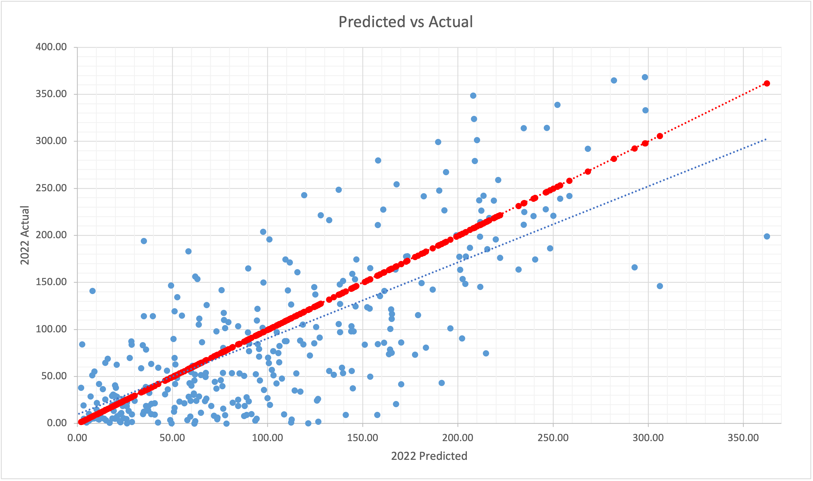

## Introduction

The goal of this project is to accurately predict the season long leaders for the upcoming
2023 fantasy football season. I scraped the career stats of each player in the 2022 scrimmage 
yards table from Pro Football Reference. The methodology of these predictions were inspired by
Louis Rosenblum. 

## Data

These stats were scraped using a python script that visits each player's hyperlink and pulls their
career data. The stats are cleaned so that for each year the "per game" stats are displayed for
each player. Included in the dataset are the career averages up to the year that is being pulled,
so a player's rookie season will show all zeros. The career average variables have the prefix "c"
and cover all the variables listed below. The full dataset and script can be seen on my github.

| Variable | Description | Variable | Description |
| --- | --- | --- | --- |
| Year | Season w/ >= 1 game played | Pos | Player position |
| Scrim | Total yards receiving & rushing | TOT TD | Total touchdowns |
| Fmbl | Total fumbles lost | Rec | Total receptions |
| Tgt | Total receiving targets | Att | Total rushing attempts |
| Age | Years old | Rush yds | Total rushing yards |
| Rec yds | Total receiving yards | Y/R | Yards per reception |
| Rec TD | Total receiving touchdowns | Catch% | Total receptions over total targets |
| Rush TD | Total rushing touchdowns | Yards/att | Yards per rush attempt |
| Touch | All events where player touches ball | Y/T | Yards per touch |
| G | Games played | GS | Games where player appeared in starting lineup |

Once all the data was scraped, an additional year was added called "test" which compiled the average
of all years played for each player. The data was split into the training set (all years played so far)
and the test set (the additional test year).

